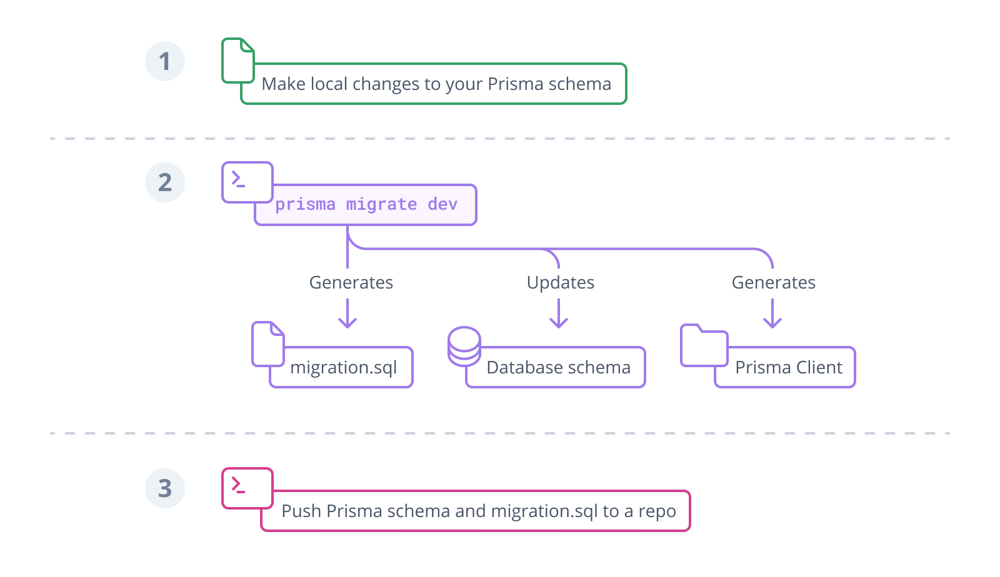

https://www.prisma.io/docs/orm/overview/introduction/what-is-prisma

Prisma ORM 是一个 [开源](https://github.com/prisma/prisma) 下一代 ORM。 它由以下部分组成：
- **Prisma Client** ：适用于 Node.js 和 TypeScript 的自动生成且类型安全的查询构建器（将在代码中导入，并使用其进行查询）
- **Prisma Migrate** ：迁移系统（将数据库与 数据模型 同步）
- **Prisma Studio** ：用于查看和编辑数据库中数据的 GUI。
> **Prisma Studio** 是 Prisma ORM 唯一非开源的部分。 您只能在本地运行 Prisma Studio。

### The Prisma schema（模型）
每个使用 Prisma ORM 工具包中的工具的项目都以 [Prisma 模式](https://www.prisma.io/docs/orm/prisma-schema) 开始。 定义其 _应用程序模型_ Prisma 架构允许开发人员直观地进行数据建模 。 它还包含与数据库的连接并定义了一个 _生成器_ ：
```
datasource db {
  provider = "postgresql" // provider = "sqlite"
  url      = env("DATABASE_URL")
}

generator client {
  provider = "prisma-client-js"
}

model Post {
  id        Int     @id @default(autoincrement())
  title     String
  content   String?
  published Boolean @default(false)
  author    User?   @relation(fields: [authorId], references: [id])
  authorId  Int?
}

model User {
  id    Int     @id @default(autoincrement())
  email String  @unique
  name  String?
  posts Post[]
}
```
> 注意：Prisma架构具有强大的数据建模功能。例如，它允许你定义“Prisma级别”的关系字段，这将使你在Prisma客户端API中更容易处理关系。在上面的例子中，User上的posts字段仅在“Prisma级别”上定义，意味着它在底层数据库中不会表现为外键。

在此架构中，您配置三件事：
- **数据源** ：指定您的数据库连接（通过环境变量）
- **Generator** ：表示要生成Prisma Client
- **数据模型** ：定义您的应用程序模型

以上数据模型的主要作用是：
- 表示关系数据库中的表或 MongoDB 中的集合（表示数据库与表的内容）
- 为 Prisma 客户端 API 中的查询提供基础


### Prisma Migrate（迁移）
完成数据建模后（或修改后），需将数据模型“获取”到 Prisma 架构中：
1. 手动调整您的 [Prisma 架构数据模型](https://www.prisma.io/docs/orm/prisma-schema/data-model/models)
2. 使用以下命令迁移您的开发数据库 `prisma migrate dev` 
3. 在您的应用程序代码中使用 Prisma Client 来访问您的数据库

https://www.prisma.io/docs/orm/prisma-migrate/getting-started
```
prisma migrate dev --name init

prisma migrate dev --name added_job_title

迁移历史记录
migrations/
  └─ 20210313140442_init/
    └─ migration.sql
  └─ 20210313140442_added_job_title/
    └─ migration.sql
```


### 使用 Prisma 客户端访问您的数据库
#### 生成 Prisma 客户端
使用 Prisma Client 的第一步是安装 `@prisma/client` npm 包：
安装 `@prisma/client` 包调用 `prisma generate`命令，该命令读取您的 Prisma 架构并 _生成_ Prisma 客户端代码。 代码 [生成到 `node_modules/.prisma/client` 默认文件夹](https://www.prisma.io/docs/orm/prisma-client/setup-and-configuration/generating-prisma-client#the-prismaclient-npm-package) 。
> prisma migrate 会自动运行 prisma generate 命令（并安装`@prisma/client`）

更改数据模型后，您需要手动重新生成 Prisma Client 以确保 `node_modules/.prisma/client` 里面的代码更新
> 更改数据模型后，执行prisma migrate即可

#### 使用 Prisma 客户端向数据库发送查询
生成 Prisma 客户端后，您可以将其导入代码中并向数据库发送查询。
##### 导入并实例化 Prisma 客户端
```ts
import { PrismaClient } from '@prisma/client'

const prisma = new PrismaClient()
```

现在您可以开始通过生成的 Prisma 客户端 API 发送查询。

Prisma Client：
https://www.prisma.io/docs/orm/overview/introduction/what-is-prisma#using-prisma-client-to-send-queries-to-your-database


