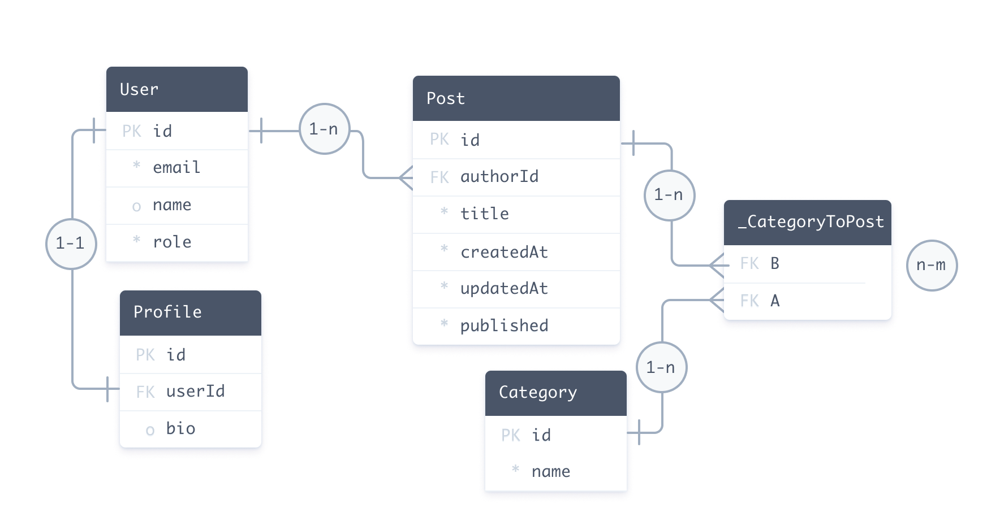

https://www.prisma.io/docs/orm/prisma-schema/overview

Prisma Schema（架构）是 Prisma ORM 设置的主要配置方法。 它由以下部分组成：
- [**数据源**](https://www.prisma.io/docs/orm/prisma-schema/overview/data-sources) : 指定 Prisma ORM 应连接的数据源的详细信息（例如 PostgreSQL 数据库）
- [**Generators**](https://www.prisma.io/docs/orm/prisma-schema/overview/generators) ：指定应根据数据模型生成哪些客户端（例如 Prisma 客户端）
- [**数据模型定义**](https://www.prisma.io/docs/orm/prisma-schema/data-model) ：指定您的应用程序 [模型](https://www.prisma.io/docs/orm/prisma-schema/data-model/models#defining-models) （每个数据源的数据形状）及其 [关系](https://www.prisma.io/docs/orm/prisma-schema/data-model/relations)

它通常是一个名为 `schema.prisma` （或多个文件 `.prisma` 文件扩展名），存储在已定义但可自定义的 [位置](https://www.prisma.io/docs/orm/prisma-schema/overview/location) 。

请参阅 [Prisma 架构 API 参考。](https://www.prisma.io/docs/orm/reference/prisma-schema-reference) 有关架构各部分的详细信息，

## 数据源
在调用 CLI 命令或运行 Prisma Client 查询时，可以使用环境变量来提供配置选项。

虽然可以在模式中直接硬编码 URL，但不推荐这样做，因为这存在安全风险。在模式中使用环境变量可以将敏感信息从模式中移出，从而提高模式的可移植性，使其能够在不同的环境中使用。

可以使用 `env()` 函数来访问环境变量：（对应项目根目录下的 .env 文件）
```
datasource db {
  provider = "postgresql"
  url      = env("DATABASE_URL")
}
```

对于sqlite数据库，因为是本地的，个人感觉直接写就行
```
datasource db {
  provider = "sqlite"
  url      = "file:./dev.db"
}
```

## 数据模型-models
https://www.prisma.io/docs/orm/prisma-schema/data-model/models

以下模式描述了一个博客平台：
```
datasource db {
  provider = "postgresql"
  url      = env("DATABASE_URL")
}

generator client {
  provider = "prisma-client-js"
}

model User {
  id      Int      @id @default(autoincrement())
  email   String   @unique
  name    String?
  role    Role     @default(USER)
  posts   Post[]
  profile Profile?
}

model Profile {
  id     Int    @id @default(autoincrement())
  bio    String
  user   User   @relation(fields: [userId], references: [id])
  userId Int    @unique
}

model Post {
  id         Int        @id @default(autoincrement())
  createdAt  DateTime   @default(now())
  updatedAt  DateTime   @updatedAt
  title      String
  published  Boolean    @default(false)
  author     User       @relation(fields: [authorId], references: [id])
  authorId   Int
  categories Category[]
}

model Category {
  id    Int    @id @default(autoincrement())
  name  String
  posts Post[]
}

enum Role {
  USER
  ADMIN
}
```

数据模型定义由以下部分组成：
- [Models](https://www.prisma.io/docs/orm/prisma-schema/data-model/models#defining-models) ([`model`](https://www.prisma.io/docs/orm/reference/prisma-schema-reference#model) primitives 模型原始类型) 定义了许多字段，包括模型之间的关系 [relations between models](https://www.prisma.io/docs/orm/prisma-schema/data-model/models#relation-fields)
- [Enums](https://www.prisma.io/docs/orm/prisma-schema/data-model/models#defining-enums) ([`enum`](https://www.prisma.io/docs/orm/reference/prisma-schema-reference#enum) primitives 枚举原始类型) （如果你的连接器支持枚举）
- 改变字段和模型行为的属性和函数。[Attributes](https://www.prisma.io/docs/orm/prisma-schema/data-model/models#defining-attributes) and [functions](https://www.prisma.io/docs/orm/prisma-schema/data-model/models#using-functions) 

对应的数据库如下所示：


以下查询使用从此数据模型生成的Prisma Client来创建：
- 一个用户记录 `User`
- 两个嵌套的帖子记录 `Post`
- 三个嵌套的类别记录 `Category`

```ts
const user = await prisma.user.create({
  data: {
    email: 'ariadne@prisma.io',
    name: 'Ariadne',
    posts: {
      create: [
        {
          title: 'My first day at Prisma',
          categories: {
            create: {
              name: 'Office',
            },
          },
        },
        {
          title: 'How to connect to a SQLite database',
          categories: {
            create: [{ name: 'Databases' }, { name: 'Tutorials' }],
          },
        },
      ],
    },
  },
})
```

## 内省和迁移
有两种方式来定义数据模型：
- **手动编写数据模型并使用Prisma Migrate**：你可以手动编写你的数据模型，并使用[Prisma Migrate](https://www.prisma.io/docs/orm/prisma-migrate)将其映射到你的数据库。在这种情况下，数据模型是你应用模型的唯一真实来源。
- **通过内省生成数据模型**：当你有一个现有的数据库或者更喜欢使用SQL迁移你的数据库模式时，你可以通过[内省](https://www.prisma.io/docs/orm/prisma-schema/introspection)你的数据库来生成数据模型。在这种情况下，数据库模式是你应用模型的唯一真实来源。

## 定义模型model
模型代表你的应用领域的实体。模型由[`model`](https://www.prisma.io/docs/orm/reference/prisma-schema-reference#model)块表示，并定义了许多[字段](https://www.prisma.io/docs/orm/reference/prisma-schema-reference#model-fields)。在上面的示例数据模型中，`User`，`Profile`，`Post`和`Category`都是模型。

博客平台可以通过以下模型进行扩展：
```
model Comment {
	// 字段
}
model Tag {
	// 字段
}
```

#### 将模型名称映射到表或集合
Prisma模型的[命名规则（单数形式，PascalCase大驼峰）](https://www.prisma.io/docs/orm/reference/prisma-schema-reference#naming-conventions)并不总是与数据库中的表名匹配。在数据库中命名表/集合的常见方法是使用复数形式和[snake_case下划线分割](https://en.wikipedia.org/wiki/Snake_case)表示法 - 例如：`comments`。当你对一个名为`comments`的表进行内省时，结果Prisma模型将如下所示：
```
model comments {
	// 字段
}
```

然而，你仍然可以通过使用[`@@map`](https://www.prisma.io/docs/orm/reference/prisma-schema-reference#map-1)属性坚持命名规则，而不需要在数据库中重命名底层的`comments`表：
```
model Comment {
	// 字段  
	
	@@map("comments")
}
```
有了这个模型定义，Prisma ORM会自动将 `Comment` 模型映射到底层数据库的 `comments` 表。
> **注意**：你也可以[`@map`](https://www.prisma.io/docs/orm/reference/prisma-schema-reference#map)一个列名或枚举值，并且`@@map`一个枚举名。

`@map`和`@@map`允许你通过解耦模型和字段名称与底层数据库中的表和列名称来[调整你的Prisma Client API的形状](https://www.prisma.io/docs/orm/prisma-client/setup-and-configuration/custom-model-and-field-names#using-map-and-map-to-rename-fields-and-models-in-the-prisma-client-api)。


## 定义字段fields
模型的属性被称为 _字段_，它们包括：
- **[字段名称](https://www.prisma.io/docs/orm/reference/prisma-schema-reference#model-fields)**
- **[字段类型](https://www.prisma.io/docs/orm/reference/prisma-schema-reference#model-fields)**
- 可选的 **[类型修饰符](https://www.prisma.io/docs/orm/prisma-schema/data-model/models#type-modifiers)**
- 可选的 **[属性](https://www.prisma.io/docs/orm/prisma-schema/data-model/models#defining-attributes)**，包括[原生数据库类型属性](https://www.prisma.io/docs/orm/prisma-schema/data-model/models#native-types-mapping)

字段的类型决定了其 _结构_，并分为以下两类：
- [标量类型](https://www.prisma.io/docs/orm/prisma-schema/data-model/models#scalar-fields)（包括[枚举](https://www.prisma.io/docs/orm/prisma-schema/data-model/models#defining-enums)）映射到数据库中的列（关系数据库）或文档字段（MongoDB） - 例如，[`String`](https://www.prisma.io/docs/orm/reference/prisma-schema-reference#string) 或 [`Int`](https://www.prisma.io/docs/orm/reference/prisma-schema-reference#int)
- 模型类型（字段被称为[关系字段](https://www.prisma.io/docs/orm/prisma-schema/data-model/relations#relation-fields)） - 例如 `Post` 或 `Comment[]`。（底层数据库的表中不会保存）

以下表格描述了以上示例中`User`模型的字段：

|名称|类型|标量 vs 关系|类型修饰符|属性|
|---|---|---|---|---|
|`id`|`Int`|标量|-|`@id` 和 `@default(autoincrement())`|
|`email`|`String`|标量|-|`@unique`|
|`name`|`String`|标量|`?`|-|
|`role`|`Role`|标量 (`enum`)|-|`@default(USER)`|
|`posts`|`Post`|关系 (Prisma级别字段)|`[]`|-|
|`profile`|`Profile`|关系 (Prisma级别字段)|`?`|-|


#### 标量字段
以下示例使用几种标量类型扩展了 `Comment` 和 `Tag` 模型。一些字段包括 属性[attributes](https://www.prisma.io/docs/orm/prisma-schema/data-model/models#defining-attributes)：
```
model Comment {
  id      Int    @id @default(autoincrement())
  title   String
  content String
}

model Tag {
  name String @id
}
```
请参阅 [标量字段类型的完整列表](https://www.prisma.io/docs/orm/reference/prisma-schema-reference#model-field-scalar-types) 

#### 关系字段
关系字段的类型是另一种模型 - 例如，帖子 ( `Post`）可以有多个评论（ `Comment[]`):
```
model Post {
  id       Int       @id @default(autoincrement())
  // Other fields
  comments Comment[] // A post can have many comments
}

model Comment {
  id     Int
  // Other fields
  post   Post? @relation(fields: [postId], references: [id]) 
  // A comment can have one post
  postId Int?
}
```
请参阅 [关系文档。](https://www.prisma.io/docs/orm/prisma-schema/data-model/relations) 有关模型之间关系的更多示例和信息，

#### 本机类型映射
https://www.prisma.io/docs/orm/prisma-schema/data-model/models#native-types-mapping

#### 类型修饰符
可以通过附加两个修饰符之一来修改字段的类型：
- [`[]`](https://www.prisma.io/docs/orm/reference/prisma-schema-reference#-modifier) 将字段设为列表
- [`?`](https://www.prisma.io/docs/orm/reference/prisma-schema-reference#-modifier-1) 将字段设置为可选

> **注意** ：您 **不能** 组合类型修饰符 - 不支持可选列表。

##### 列表
以下示例包括标量列表和相关模型的列表：
```
model Post {
  id       Int       @id @default(autoincrement())
  // Other fields
  comments Comment[] // A list of comments
  keywords String[] // A scalar list
}
```
> **注意** ： **仅** 当数据库连接器本身或在 Prisma ORM 级别支持标量列表时，才支持标量列表。
> 
> 在Prisma中，`String[]`类型表示一个字符串数组，这是一个标量列表。然而，SQLite并不直接支持数组类型。当你在Prisma模型中使用`String[]`类型并使用SQLite作为数据库时，Prisma会将这个字段存储为一个文本字段，其中数组的每个元素都被转换为字符串并用逗号分隔。
> 
> 例如，如果你有一个`keywords`字段，其值为`["prisma", "sqlite", "database"]`，那么在SQLite数据库中，这个字段的值将被存储为`"prisma,sqlite,database"`。
> 
> 当你从数据库中查询这个字段时，Prisma会自动将这个逗号分隔的字符串转换回原始的字符串数组，所以你可以像处理普通的JavaScript数组一样处理它。
>
> 请注意，由于这种实现方式的限制，你不能在这种类型的字段上执行某些类型的查询，例如查找包含特定元素的数组。希望这个解答对你有所帮助！

##### 可选和必填字段
```
model Comment {
  id      Int     @id @default(autoincrement())
  title   String
  content String?
}

model Tag {
  name String @id
}
```

当一个字段**没有**用`?`类型修饰符进行注解时，该字段将在模型的每个记录中都是 _必需的_。这在两个层面上产生影响：
- **数据库**
    - **关系数据库**：必需字段在底层数据库中通过`NOT NULL`约束来表示。
    - **MongoDB**：在MongoDB数据库层面，必需字段并不是一个概念。
- **Prisma客户端**：Prisma客户端生成的[TypeScript类型](https://www.prisma.io/docs/orm/prisma-schema/data-model/models#type-definitions)，它们在你的应用程序代码中代表了你的模型，也会将这些字段定义为必需的，以确保它们在运行时总是携带值。

> **注意**：可选字段的默认值是`null`。

#### 不支持的类型
https://www.prisma.io/docs/orm/prisma-schema/data-model/models#unsupported-types


## 定义属性
属性可以修改字段或模型块的行为。以下示例包括三个字段属性（[`@id`](https://www.prisma.io/docs/orm/reference/prisma-schema-reference#id) , [`@default`](https://www.prisma.io/docs/orm/reference/prisma-schema-reference#default) , and [`@unique`](https://www.prisma.io/docs/orm/reference/prisma-schema-reference#unique)）和一个块属性（[`@@unique`](https://www.prisma.io/docs/orm/reference/prisma-schema-reference#unique-1)）：
（原来@@前缀都是块属性，会作用于model）
```
model User {
  id        Int     @id @default(autoincrement())
  firstName String
  lastName  String
  email     String  @unique
  isAdmin   Boolean @default(false)

  @@unique([firstName, lastName])
}
```

一些属性接受[参数](https://www.prisma.io/docs/orm/reference/prisma-schema-reference#attribute-argument-types) - 例如，`@default`接受`true`或`false`：
```
isAdmin   Boolean @default(false) // @default(value: false)的简写形式
```
请查看[字段和块属性的完整列表](https://www.prisma.io/docs/orm/reference/prisma-schema-reference#attributes)。


#### 定义 ID 字段
ID 唯一地标识模型的各个记录。一个模型只能有一个 ID：
- 在**关系数据库**中，ID 可以是一个单独的字段，也可以基于多个字段。如果模型没有 `@id` 或 `@@id`，你必须定义一个强制的 `@unique` 字段或 `@@unique` 块。
- 在**MongoDB**中，ID 必须是一个定义了 `@id` 属性和 `@map("_id")` 属性的单一字段。

在关系数据库中，ID 可以使用 [`@id`](https://www.prisma.io/docs/orm/reference/prisma-schema-reference#id) 属性由单个字段定义，或者使用 [`@@id`](https://www.prisma.io/docs/orm/reference/prisma-schema-reference#id-1) 属性由多个字段定义。

##### 单字段 ID
在以下示例中，`User` ID 由 `id` 整数字段表示：
```
model User {
  id      Int      @id @default(autoincrement())
  email   String   @unique
  name    String?
  role    Role     @default(USER)
  posts   Post[]
  profile Profile?
}
```

##### 复合ID
https://www.prisma.io/docs/orm/prisma-schema/data-model/models#composite-ids

#### 定义默认值
您可以使用 [`@default`](https://www.prisma.io/docs/orm/reference/prisma-schema-reference#default) 属性定义模型标量字段的默认值：
```
model Post {
  id         Int        @id @default(autoincrement())
  createdAt  DateTime   @default(now())
  title      String
  published  Boolean    @default(false)
  author     User       @relation(fields: [authorId], references: [id])
  authorId   Int
  categories Category[] @relation(references: [id])
}
```
https://www.prisma.io/docs/orm/prisma-schema/data-model/models#defining-a-default-value

#### 定义唯一字段
您可以向模型添加唯一属性，以便能够唯一标识该模型的各个记录。 可以使用以下方法在单个字段上定义唯一属性 [`@unique`](https://www.prisma.io/docs/orm/reference/prisma-schema-reference#unique) 属性，或在多个字段（也称为复合或复合唯一约束）上使用 [`@@unique`](https://www.prisma.io/docs/orm/reference/prisma-schema-reference#unique-1) 属性。
```
model User {
  id    Int     @id @default(autoincrement())
  email String  @unique
  name  String?
}
```
https://www.prisma.io/docs/orm/prisma-schema/data-model/models#defining-a-unique-field

#### 定义索引
**提高查询速度**
https://www.prisma.io/docs/orm/prisma-schema/data-model/models#defining-an-index

## 定义枚举
你可以在数据模型中定义枚举类型，[如果你的数据库连接器支持枚举类型](https://www.prisma.io/docs/orm/reference/database-features#misc)，无论是原生支持还是在 Prisma ORM 级别支持。

在 Prisma schema 数据模型中，枚举类型被视为[标量](https://www.prisma.io/docs/orm/prisma-schema/data-model/models#scalar-fields)类型。因此，它们[默认](https://www.prisma.io/docs/orm/prisma-client/queries/select-fields#return-the-default-selection-set)会被包含在[Prisma Client 查询](https://www.prisma.io/docs/orm/prisma-client/queries/crud)的返回值中。

枚举类型是通过[`enum`](https://www.prisma.io/docs/orm/reference/prisma-schema-reference#enum)块来定义的。例如，一个 `User` 有一个 `Role`：
```
model User {
  id    Int     @id @default(autoincrement())
  email String  @unique
  name  String?
  role  Role    @default(USER)
}

enum Role {
  USER
  ADMIN
}
```

## 使用函数
Prisma schema 支持许多[函数](https://www.prisma.io/docs/orm/reference/prisma-schema-reference#attribute-functions)。这些函数可以用来在模型的字段上指定[默认值](https://www.prisma.io/docs/orm/reference/prisma-schema-reference#default)。

例如，`createdAt` 的默认值是 [`now()`](https://www.prisma.io/docs/orm/reference/prisma-schema-reference#now)：
```
model Post {
  id        Int      @id @default(autoincrement())
  createdAt DateTime @default(now())
}
```

[`cuid()`](https://www.prisma.io/docs/orm/reference/prisma-schema-reference#cuid) 和 [`uuid()`](https://www.prisma.io/docs/orm/reference/prisma-schema-reference#uuid) 是由 Prisma ORM 实现的，因此在底层数据库模式中不可见。你仍然可以在使用[内省](https://www.prisma.io/docs/orm/prisma-schema/introspection)时使用它们，通过[手动更改你的 Prisma schema](https://www.prisma.io/docs/orm/prisma-client/setup-and-configuration/custom-model-and-field-names) 和 [生成 Prisma Client](https://www.prisma.io/docs/orm/prisma-client/setup-and-configuration/generating-prisma-client)，在这种情况下，值将由 Prisma Client 的 [查询引擎](https://www.prisma.io/docs/orm/more/under-the-hood/engines) 生成。

对 [`autoincrement()`](https://www.prisma.io/docs/orm/reference/prisma-schema-reference#autoincrement)、[`now()`](https://www.prisma.io/docs/orm/reference/prisma-schema-reference#now) 和 [`dbgenerated(...)`](https://www.prisma.io/docs/orm/reference/prisma-schema-reference#dbgenerated) 的支持在数据库之间有所不同。

**关系数据库连接器** 在数据库级别实现 `autoincrement()`、`dbgenerated(...)` 和 `now()`。**MongoDB 连接器** 不支持 `autoincrement()` 或 `dbgenerated(...)`，并且 `now()` 是在 Prisma ORM 级别实现的。[`auto()`](https://www.prisma.io/docs/orm/reference/prisma-schema-reference#auto) 函数用于生成 `ObjectId`。

## Relations关系
请参阅 [关系文档。](https://www.prisma.io/docs/orm/prisma-schema/data-model/relations)

[04-Relations关系](04-Relations关系.md)

## introspection内省
https://www.prisma.io/docs/orm/prisma-schema/introspection