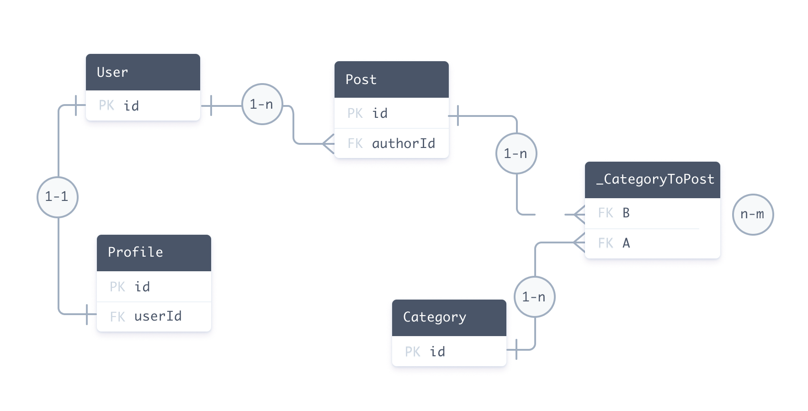

https://www.prisma.io/docs/orm/prisma-schema/data-model/relations

## 关系
关系是 Prisma schema 中两个模型之间的连接。例如，User 和 Post 之间存在一对多的关系，因为一个用户可以有很多博客文章。

以下 Prisma schema 定义了 User 和 Post 模型之间的一对多关系。
```
model User {
  id    Int    @id @default(autoincrement())
  posts Post[]
}

model Post {
  id       Int  @id @default(autoincrement())
  author   User @relation(fields: [authorId], references: [id])
  authorId Int // 关系标量字段，用于上面的 `@relation` 属性
}
```

在 Prisma ORM 层面，`User` / `Post` 关系由以下部分组成：
- 两个[关系字段](https://www.prisma.io/docs/orm/prisma-schema/data-model/relations#relation-fields)：`author` 和 `posts`。关系字段在 Prisma ORM 层面定义了模型之间的连接，**并不存在于数据库中**。这些字段用于生成 Prisma 客户端。
- 标量 `authorId` 字段，被 `@relation` 属性引用。这个字段**确实存在于数据库中** - 它是连接 `Post` 和 `User` 的外键。

在 Prisma ORM 层面，两个模型之间的连接**总是**由关系的**每一侧**的[关系字段](https://www.prisma.io/docs/orm/prisma-schema/data-model/relations#relation-fields)表示。

### 数据库中的关系
一对多关系 `User` 和 `Post`


在 SQL 中，你使用 _外键_ 在两个表之间创建关系。外键存储在关系的**一侧**。我们的例子包括：
- `Post` 表中名为 `authorId` 的外键列。
- `User` 表中名为 `id` 的主键列。`Post` 表中的 `authorId` 列引用 `User` 表中的 `id` 列。

在 Prisma schema 中，外键 / 主键关系由 `author` 字段上的 `@relation` 属性表示：
```
author     User        @relation(fields: [authorId], references: [id])
```

> **注意**：Prisma 模式中的关系代表数据库中表之间存在的关系。如果关系在数据库中不存在，那么它在 Prisma 模式中也不存在。

### Prisma 客户端中的关系
Prisma 客户端是从 Prisma 模式生成的。以下示例演示了当你使用 Prisma 客户端获取、创建和更新记录时，关系如何表现。

#### 创建记录和嵌套记录
以下查询创建一个 `User` 记录和两个连接的 `Post` 记录：
```ts
const userAndPosts = await prisma.user.create({
  data: {
    posts: {
      create: [
        { title: 'Prisma Day 2020' }, // 使用用户的 id 填充 authorId
        { title: 'How to write a Prisma schema' }, // 使用用户的 id 填充 authorId
      ],
    },
  },
})
```

在底层数据库中，此查询：
1. 创建一个带有自动生成的 `id` 的 `User`（例如，`20`）
2. 创建两个新的 `Post` 记录，并将两个记录的 `authorId` 都设置为 `20`

#### 检索记录并包含相关记录
以下查询通过 `id` 检索一个 `User` 并包含任何相关的 `Post` 记录：
```ts
const getAuthor = await prisma.user.findUnique({
  where: {
    id: "20",
  },
  include: {
    posts: true, // 所有 authorId == 20 的帖子
  },
});
```

在底层数据库中，此查询：
1. 检索 `id` 为 `20` 的 `User` 记录
2. 检索所有 `authorId` 为 `20` 的 `Post` 记录

#### 将现有记录关联到另一个现有记录
以下查询将现有的 `Post` 记录与现有的 `User` 记录关联：
```ts
const updateAuthor = await prisma.user.update({
  where: {
    id: 20,
  },
  data: {
    posts: {
      connect: {
        id: 4,
      },
    },
  },
})
```

在底层数据库中，此查询使用 [嵌套的 `connect` 查询](https://www.prisma.io/docs/orm/reference/prisma-client-reference#connect) 将 `id` 为 4 的帖子链接到 `id` 为 20 的用户。查询通过以下步骤完成此操作：
- 查询首先查找 `id` 为 `20` 的用户。
- 然后查询将 `authorID` 外键设置为 `20`。这将 `id` 为 `4` 的帖子链接到 `id` 为 `20` 的用户。

在此查询中，`authorID` 的当前值并不重要。无论其当前值如何，查询都会将 `authorID` 更改为 `20`。

### 关系类型
Prisma ORM 中的关系有三种不同的类型（或 [基数Cardinality](https://en.wikipedia.org/wiki/Cardinality_(data_modeling)) ) ：
- [一对一](https://www.prisma.io/docs/orm/prisma-schema/data-model/relations/one-to-one-relations) （也称为 1-1 关系）
- [一对多](https://www.prisma.io/docs/orm/prisma-schema/data-model/relations/one-to-many-relations) （也称为 1-n 关系）
- [多对多](https://www.prisma.io/docs/orm/prisma-schema/data-model/relations/many-to-many-relations) （也称为 mn 关系）

以下 Prisma 架构包括每种类型的关系：
- 一对一： `User` ↔ `Profile`
- 一对多： `User` ↔ `Post`
- 多对多： `Post` ↔ `Category`

```
model User {
  id      Int      @id @default(autoincrement())
  posts   Post[]
  profile Profile?
}

model Profile {
  id     Int  @id @default(autoincrement())
  user   User @relation(fields: [userId], references: [id])
  userId Int  @unique // relation scalar field (used in the `@relation` attribute above)
}

model Post {
  id         Int        @id @default(autoincrement())
  author     User       @relation(fields: [authorId], references: [id])
  authorId   Int        // relation scalar field  (used in the `@relation` attribute above)
  categories Category[]
}

model Category {
  id    Int    @id @default(autoincrement())
  posts Post[]
}
```
> 此示例使用 [隐式多对多关系](https://www.prisma.io/docs/orm/prisma-schema/data-model/relations/many-to-many-relations#implicit-many-to-many-relations) 。 这些关系不需要 `@relation` 属性，除非您需要 [消除关系的歧义](https://www.prisma.io/docs/orm/prisma-schema/data-model/relations#disambiguating-relations) 。



#### 隐式和显式多对多关系
关系数据库中的多对多关系可以通过两种方式建模：
- [显式多对多关系](https://www.prisma.io/docs/orm/prisma-schema/data-model/relations/many-to-many-relations#explicit-many-to-many-relations) ，其中关系表在 Prisma schema中表示为显式模型
- [隐式多对多关系](https://www.prisma.io/docs/orm/prisma-schema/data-model/relations/many-to-many-relations#implicit-many-to-many-relations) ，其中 Prisma ORM 管理关系表，并且它不会出现在 Prisma schema中。

隐式多对多关系要求两个模型都有一个 `@id`。 请注意以下事项：
- 您不能使用 [多字段 ID](https://www.prisma.io/docs/orm/reference/prisma-schema-reference#id-1)
- 您不能使用 `@unique` 代替一个 `@id`

隐式多对多关系仍然体现在底层数据库的关系表中。 然而，Prisma ORM 管理这个关系表。

如果您使用隐式多对多关系而不是显式关系，它会使 [Prisma Client API](https://www.prisma.io/docs/orm/prisma-client) 内部的嵌套级别会减少 [更简单（因为，例如，嵌套写入）](https://www.prisma.io/docs/orm/prisma-client/queries/relation-queries#nested-writes)。

如果您不使用 Prisma Migrate，而是通过 [内省](https://www.prisma.io/docs/orm/prisma-schema/introspection) 来使用隐式多对多关系 [获取数据模型，您仍然可以通过遵循 Prisma ORM 的关系表约定](https://www.prisma.io/docs/orm/prisma-schema/data-model/relations/many-to-many-relations#conventions-for-relation-tables-in-implicit-m-n-relations) 。

### 关系字段
在Prisma的[模型](https://www.prisma.io/docs/orm/prisma-schema/data-model/models#defining-models)中，关系[字段](https://www.prisma.io/docs/orm/prisma-schema/data-model/models#defining-fields)并**没有**一个[标量类型](https://www.prisma.io/docs/orm/prisma-schema/data-model/models#scalar-fields)。相反，它们的类型是另一个模型。

每个关系必须在每个模型上都有两个关系字段。在一对一和一对多关系中，需要一个额外的 _关系标量字段_ ，它通过 `@relation` 属性中的两个关系字段之一进行链接。这个关系标量是底层数据库中 _外键_ 的直接表示。
```
model User {
  id    Int    @id @default(autoincrement())
  email String @unique
  role  Role   @default(USER)
  posts Post[]
}

model Post {
  id       Int    @id @default(autoincrement())
  title    String
  author   User   @relation(fields: [authorId], references: [id])
  authorId Int // relation scalar field (used in the `@relation` attribute above)
}
```

|Model|Field|Relational|Relation field|
|---|---|---|---|
|`User`|`id`|`Int`|No|
||`email`|`String`|No|
||`role`|`Role`|No|
||`posts`|`Post[]`|**Yes** (Prisma ORM-level)|
|`Post`|`id`|`Int`|No|
||`title`|`String`|No|
||`authorId`|`Int`|No (_relation scalar field_)|
||`author`|`User`|**Yes** (_annotated_)|

`posts`和`author`都是关系字段，因为它们的类型不是标量类型，而是其他模型。

还要注意，带注解的关系字段`author`需要在`@relation`属性内部链接到`Post`模型上的关系标量字段`authorId`。关系标量代表了底层数据库中的外键。

另一个名为`posts`的关系字段纯粹在Prisma ORM级别上定义，它并不在数据库中体现。


#### 带注解的关系字段
需要一方用`@relation`属性进行 _注解_ 的关系被称为 _带注解的关系字段_ 。这包括：
- 一对一关系
- 一对多关系
- 仅适用于MongoDB的多对多关系

带有`@relation`属性注解的关系一方代表了在底层数据库中**存储外键**的一方。在该关系一方，也需要"实际"代表外键的字段，它被称为 _关系标量字段_，并在`@relation`属性内部被引用：
```
author     User    @relation(fields: [authorId], references: [id])
authorId   Int
```
当一个标量字段被用在`@relation`属性的`fields`中时，它 _变成了_ 一个关系标量字段。

#### 关系标量字段
> 在生成的 [Prisma Client API](https://www.prisma.io/docs/orm/prisma-client) 中，关系标量字段是只读的。如果你想在代码中更新一个关系，你可以使用 [嵌套写入](https://www.prisma.io/docs/orm/prisma-client/queries/relation-queries#nested-writes) 来实现。

##### 关系标量命名规则
因为一个关系标量字段总是 _属于_ 一个关系字段，所以通常遵循以下命名规则：
- 关系字段：`author`
- 关系标量字段：`authorId`（关系字段名称 + `Id`）


### `@relation` 属性
[`@relation`](https://www.prisma.io/docs/orm/reference/prisma-schema-reference#relation) 属性只能应用于[关系字段](https://www.prisma.io/docs/orm/prisma-schema/data-model/relations#relation-fields)，而不能应用于[标量字段](https://www.prisma.io/docs/orm/prisma-schema/data-model/models#scalar-fields)。

当以下情况时，需要`@relation`属性：
- 你定义了一对一或一对多关系，它在关系的 _一侧_ 是必需的（与相应的关系标量字段一起）
- 你需要消除关系的歧义（例如，当你在同一模型之间有两个关系时）
- 你定义了[自关联](https://www.prisma.io/docs/orm/prisma-schema/data-model/relations/self-relations)
- 你为MongoDB定义了[多对多关系](https://www.prisma.io/docs/orm/prisma-schema/data-model/relations/many-to-many-relations#mongodb)
- 你需要控制关系表在底层数据库中的表示方式（例如，为关系表使用特定名称）

> **注意**：关系型数据库中的[隐式多对多关系](https://www.prisma.io/docs/orm/prisma-schema/data-model/relations/many-to-many-relations#implicit-many-to-many-relations)不需要`@relation`属性。


### 消除关系歧义
当你在同两个模型之间定义两个关系时，你需要在`@relation`属性中添加`name`参数以消除它们的歧义。为什么需要这样做的一个例子，参考以下模型：
```
// 注意：这个模式是故意错误的。请参阅下面的解决方案。

model User {
  id           Int     @id @default(autoincrement())
  name         String?
  writtenPosts Post[]
  pinnedPost   Post?
}

model Post {
  id         Int     @id @default(autoincrement())
  title      String?
  author     User    @relation(fields: [authorId], references: [id])
  authorId   Int
  pinnedBy   User?   @relation(fields: [pinnedById], references: [id])
  pinnedById Int?
}
```

在这种情况下，关系是模糊的，有四种不同的解释方式：
- `User.writtenPosts` ↔ `Post.author` + `Post.authorId`
- `User.writtenPosts` ↔ `Post.pinnedBy` + `Post.pinnedById`
- `User.pinnedPost` ↔ `Post.author` + `Post.authorId`
- `User.pinnedPost` ↔ `Post.pinnedBy` + `Post.pinnedById`

为了消除这些关系的歧义，你需要用`@relation`属性注解关系字段，并提供`name`参数。你可以设置任何`name`（除了空字符串`""`），但它必须在关系的两侧都是相同的：
```
model User {
  id           Int     @id @default(autoincrement())
  name         String?
  writtenPosts Post[]  @relation("WrittenPosts")
  pinnedPost   Post?   @relation("PinnedPost")
}

model Post {
  id         Int     @id @default(autoincrement())
  title      String?
  author     User    @relation("WrittenPosts", fields: [authorId], references: [id])
  authorId   Int
  pinnedBy   User?   @relation("PinnedPost", fields: [pinnedById], references: [id])
  pinnedById Int?    @unique
}
```


## 一对一的关系
https://www.prisma.io/docs/orm/prisma-schema/data-model/relations/one-to-one-relations

一对一（1-1）关系是指在关系的两侧最多只能连接**一个**记录。在下面的例子中，`User`和`Profile`之间存在一对一的关系：
```
model User {
  id      Int      @id @default(autoincrement())
  profile Profile?
}

model Profile {
  id     Int  @id @default(autoincrement())
  user   User @relation(fields: [userId], references: [id])
  userId Int  @unique // 关系标量字段（在上面的 `@relation` 属性中使用）
}
```

`userId`关系标量是底层数据库中外键的直接表示。这种一对一关系表达了以下内容：
- "一个用户可以有零个或一个个人资料"（因为 `User` 上的 `profile` 字段是[可选的](https://www.prisma.io/docs/orm/prisma-schema/data-model/models#type-modifiers)）
- "个人资料必须始终连接到一个用户"

在前面的例子中，`Profile`模型的 `user` 关系字段引用了 `User` 模型的 `id` 字段。你也可以引用不同的字段。在这种情况下，你需要用 `@unique` 属性标记字段，以保证每个 `Profile` 只连接到一个 `User`。在下面的例子中，`user` 字段引用了 `User` 模型中的 `email` 字段，该字段被标记为 `@unique` 属性：
```
model User {
  id      Int      @id @default(autoincrement())
  email   String   @unique // <-- 添加 unique 属性
  profile Profile?
}

model Profile {
  id        Int    @id @default(autoincrement())
  user      User   @relation(fields: [userEmail], references: [email])
  userEmail String @unique // 关系标量字段（在上面的 `@relation` 属性中使用）
}
```


## 一对多关系
https://www.prisma.io/docs/orm/prisma-schema/data-model/relations/one-to-many-relations

一对多（1-n）关系是指在关系的一侧可以连接零个或多个记录。在下面的例子中，`User`和`Post`模型之间存在一个一对多的关系：
```
model User {
  id    Int    @id @default(autoincrement())
  posts Post[]
}

model Post {
  id       Int  @id @default(autoincrement())
  author   User @relation(fields: [authorId], references: [id])
  authorId Int
}
```

> **注意** `posts`字段在底层数据库模式中并没有"显现"。在关系的另一侧，[带注解的关系字段](https://www.prisma.io/docs/orm/prisma-schema/data-model/relations#relation-fields) `author` 和它的关系标量 `authorId` 代表了在底层数据库中存储外键的关系一侧。

这种一对多关系表达了以下内容：
- "一个用户可以有零个或多个帖子"
- "一个帖子必须始终有一个作者"

在前面的例子中，`Post`模型的 `author` 关系字段引用了 `User` 模型的 `id` 字段。你也可以引用不同的字段。在这种情况下，你需要用 `@unique` 属性标记字段，以保证每个 `Post` 只连接到一个 `User`。在下面的例子中，`author` 字段引用了 `User` 模型中的 `email` 字段，该字段被标记为 `@unique` 属性：
```
model User {
  id    Int    @id @default(autoincrement())
  email String @unique // <-- 添加 unique 属性
  posts Post[]
}

model Post {
  id          Int    @id @default(autoincrement())
  authorEmail String
  author      User   @relation(fields: [authorEmail], references: [email])
}
```


## 多对多关系
在关系数据库中，m-n 关系通常通过[关系表](https://www.prisma.io/docs/orm/prisma-schema/data-model/relations/many-to-many-relations#relation-tables)进行建模。在 Prisma 模式中，m-n 关系可以是[显式的](https://www.prisma.io/docs/orm/prisma-schema/data-model/relations/many-to-many-relations#explicit-many-to-many-relations)或[隐式的](https://www.prisma.io/docs/orm/prisma-schema/data-model/relations/many-to-many-relations#implicit-many-to-many-relations)。如果你不需要在关系表本身中存储任何额外的元数据，我们建议使用[隐式的](https://www.prisma.io/docs/orm/prisma-schema/data-model/relations/many-to-many-relations#implicit-many-to-many-relations) m-n 关系。如果需要，你可以随时迁移到[显式的](https://www.prisma.io/docs/orm/prisma-schema/data-model/relations/many-to-many-relations#explicit-many-to-many-relations) m-n 关系。

- 显式多对多关系： https://www.prisma.io/docs/orm/prisma-schema/data-model/relations/many-to-many-relations#explicit-many-to-many-relations
- 隐式多对多关系： https://www.prisma.io/docs/orm/prisma-schema/data-model/relations/many-to-many-relations#implicit-many-to-many-relations
- 显示的有点麻烦，下面主要讲隐式

隐式多对多关系（m-n）在关系的两边都定义为列表字段。虽然关系表存在于底层数据库中，但**它由Prisma ORM管理，并不会在Prisma schema中体现**。隐式关系表遵循一种[特定的约定](https://www.prisma.io/docs/orm/prisma-schema/data-model/relations/many-to-many-relations#conventions-for-relation-tables-in-implicit-m-n-relations)。

隐式多对多关系使得[Prisma Client API](https://www.prisma.io/docs/orm/prisma-client)对于多对多关系的操作更加简单（因为在[nested writes](https://www.prisma.io/docs/orm/prisma-client/queries/relation-queries#nested-writes)中少了一个嵌套层级）。

在下面的例子中，`Post`和`Category`之间有一个隐式的多对多关系：
```
model Post {
  id         Int        @id @default(autoincrement())
  title      String
  categories Category[]
}

model Category {
  id    Int    @id @default(autoincrement())
  name  String
  posts Post[]
}
```

#### 查询隐式多对多
以下部分演示如何查询 [隐式 mn](https://www.prisma.io/docs/orm/prisma-schema/data-model/relations/many-to-many-relations#implicit-many-to-many-relations) 关系。 这些查询比 [显式 mn 查询](https://www.prisma.io/docs/orm/prisma-schema/data-model/relations/many-to-many-relations#querying-an-explicit-many-to-many) 需要更少的嵌套。

以下查询创建一个 `Post` 和多个 `Category` 记录：
```ts
const createPostAndCategory = await prisma.post.create({
  data: {
    title: 'How to become a butterfly',
    categories: {
      create: [{ name: 'Magic' }, { name: 'Butterflies' }],
    },
  },
})
```

以下查询创建一个 `Category` 和多个 `Post` 记录：
```ts
const createCategoryAndPosts = await prisma.category.create({
  data: {
    name: 'Stories',
    posts: {
      create: [
        { title: 'That one time with the stuff' },
        { title: 'The story of planet Earth' },
      ],
    },
  },
})
```

以下查询返回所有 `Post` 包含该帖子指定类别列表的记录：
```ts
const getPostsAndCategories = await prisma.post.findMany({
  include: {
    categories: true,
  },
})
```


