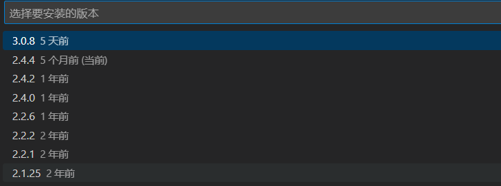

（不是非常需要，下面初始化 ESLint 配置文件时会自动安装）
```bash
pnpm add eslint@8.57.0 --save-dev
```


在项目根目录下执行以下命令，初始化 ESLint 配置文件：
```bash
pnpm create @eslint/config@0.4.6
```
才发现版本更新了，自己原来用的是0.4.6，最新的1.1.5没有代码风格选择

根据向导提示，选择适合的配置选项
```
? How would you like to use ESLint? ...
  To check syntax only
  To check syntax and find problems
> To check syntax, find problems, and enforce code style
如果你想要搭配 VSCode 插件来自动修正代码，则建议选择最后一个选项：检查语法、找到问题，并强制执行代码风格规则。

? What type of modules does your project use? ...
> JavaScript modules (import/export)
  CommonJS (require/exports)
  None of these
hono用的是JavaScript modules

? Which framework does your project use? ...
  React
  Vue.js
> None of these
对于一个 Node.js 后端项目，通常不会使用 React 或 Vue.js 这类前端框架。因此，你可以选择 "None of these" 选项。

? Does your project use TypeScript? » No / Yes
使用 TypeScript 选择 Yes

? Where does your code run? ...  (Press <space> to select, <a> to toggle all, <i> to invert selection)
√ Browser
√ Node
选择 Node


? How would you like to define a style for your project? ...
> Use a popular style guide
  Answer questions about your style
如果你想使用一个流行的代码风格指南，你可以选择 "Use a popular style guide"

? Which style guide do you want to follow? ...
> Standard: https://github.com/standard/eslint-config-standard-with-typescript
  XO: https://github.com/xojs/eslint-config-xo-typescript
Standard好像是之前学vue时提到过的

? What format do you want your config file to be in? ...
> JavaScript
  YAML
  JSON
通常情况下，JavaScript 格式是最常见的选择

eslint-config-standard-with-typescript@latest @typescript-eslint/eslint-plugin@^6.4.0 eslint@^8.0.1 eslint-plugin-import@^2.25.2 eslint-plugin-n@^15.0.0 || ^16.0.0  eslint-plugin-promise@^6.0.0 typescript@*
? Would you like to install them now? » No / Yes
安装依赖
```


注意：VSCode ESLint 插件的版本是 2.4.4
> 昨天（240622）电脑上所有项目的eslint都失效了，现在破案了，是插件的版本问题，回退到2.4.4就好了
> 
> 

打开 VSCode 设置（`Ctrl + ，`或者菜单栏中选择“文件” > “首选项” > “设置”），在设置中添加以下配置以启用在保存时自动修复错误的功能：
```json
"editor.codeActionsOnSave": {
	"source.fixAll": true
}
```